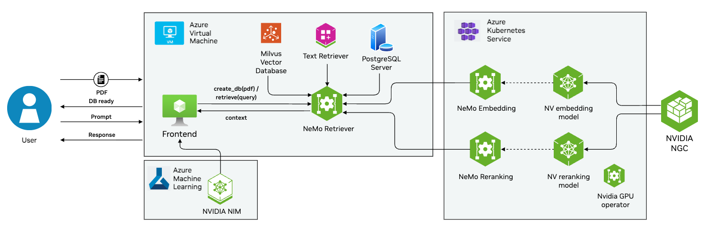

# Deploying NeMo Microservices on Azure Kubernetes service

This guide provides step-by-step instructions on how to set up and deploy NeMo Microservices on Azure Kubernetes service 
and test it using a streamlit based frontend app.

# Architecture diagram


## Setup your Azure Account
To begin, log in to your Azure account and set the appropriate subscription.

```bash
az login
az account set --subscription <your subscription>
```

## Create AKS Node Pool
Create a new node pool in your Azure Kubernetes Service (AKS) cluster. This node pool will host the GPU nodes required for running Nvidia microservices.

```bash
az aks nodepool add --resource-group <your resource group name> --cluster-name <your aks cluster name> --name <nodepool name> --node-count 2 --skip-gpu-driver-install --node-vm-size Standard_NC48ads_A100_v4 --node-osdisk-size 256 --max-pods 110
```

## Get Your AKS Context
Retrieve the AKS context to interact with your AKS cluster.

```bash
az aks get-credentials --resource-group <your resource group name> --name <your aks name>
```

## Deploy GPU operator on AKS
Add the Nvidia Helm repository and deploy the GPU operator to manage GPU resources.

```bash
helm repo add nvidia https://helm.ngc.nvidia.com/nvidia --pass-credentials
helm repo update
helm install --create-namespace --namespace nvidia-gpu-operator nvidia/gpu-operator --wait --generate-name
```

## Deploy Embedding Microservice on AKS
Deploy the embedding microservice using Helm.

```bash
helm --namespace inference-ms install nemo-embedding embedding-ms
```

## Deploy Reranking Microservice on AKS
Deploy the reranking microservice using Helm.

```bash
helm --namespace inference-ms install nemo-reranking reranking-ms
```

## Get Embedding and Reranking service IP address from kubectl

Run the command below:
```bash
kubectl get services -n inference-ms | grep "^embedding"
kubectl get services -n inference-ms | grep "^reranking"
```
Look for the IP address mentioned in the PrivateIP column and save it.

## Deploy Retriever Microservice

Create AzureVM with any GPU based instance (prefer: Standard_24ads_A100_v4) [link text](https://learn.microsoft.com/en-us/azure/virtual-machines/linux/quick-create-portal?tabs=ubuntu)

Install docker and docker compose on the machine:
```bash
sudo apt update && 
sudo apt install -y docker.io docker-compose
```

Cloning this repo onto that instance and modify the following lines in retriever-ms/docker-compose.yaml file:

```
HYBRID_EMBEDDER_URI=http://<your-embedding-service-private-ip>:<port>/v1/embeddings
RANKED_HYBRID_EMBEDDER_URI=http://<your-reranking-service-private-ip>:<port>/v1/embeddings
RANKED_HYBRID_RERANKER_URI=http://<your-reranking-service-private-ip>:<port>/v1/embeddings
```

```bash
cd retriever-ms
docker compose up
```

## Launch frontend

NOTE: You need to have access to Nvidia NeMo Retriever client python library access before proceeding

```bash
ngc registry resource download-version "ohlfw0olaadg/ea-participants/nemo-retriever-python-client:0.1.6"
```

Open a new terminal in the Virtual machine. Create a new conda environment and install the required packages mentioned in 
requirements.txt

```bash
cd frontend
conda create -n myenv python=3.10
conda activate myenv
pip install -r requirements.txt
```

Launch frontend app

```bash
streamlit run app.py
```

## Scale Down Your Node Pool to Save Costs
To save costs, scale down your GPU node pool when not in use.

```bash
az aks nodepool scale \
  --resource-group <your resource group name> \
  --cluster-name <your aks cluster name> \
  --name <nodepool name> \
  --node-count 0
```

## Check if Your Nodes are Down
Verify the status of your node pool to ensure it has scaled down correctly.

```bash
az aks nodepool show \
  --resource-group <your resource group name> \
  --cluster-name <your aks cluster name> \
  --name <nodepool name>
```

## Respin Your Nodes Next Time
When you need to use the GPU nodes again, scale the node pool back up.

```bash
az aks nodepool scale \
  --resource-group <your resource group name> \
  --cluster-name <your aks cluster name> \
  --name <nodepool name> \
  --node-count 2
```

Follow these instructions to efficiently manage your Nvidia Inference Microservices and NeMo microservices on Azure, ensuring optimal performance and cost-efficiency.
```
